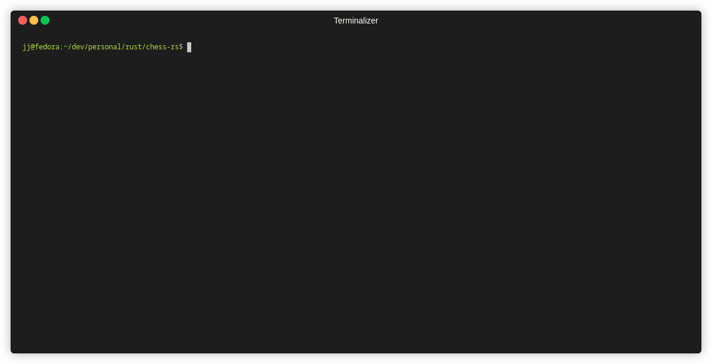

# chess in rust

## todo

- some kind of e2e test
- integration tests
- make opponent move random figure to a random field as a basic ai
- better ai - minmax
- funky stuff like `en passant`, castling, pawn promoting etc.
- [portable game notation](https://en.wikipedia.org/wiki/Portable_Game_Notation)
